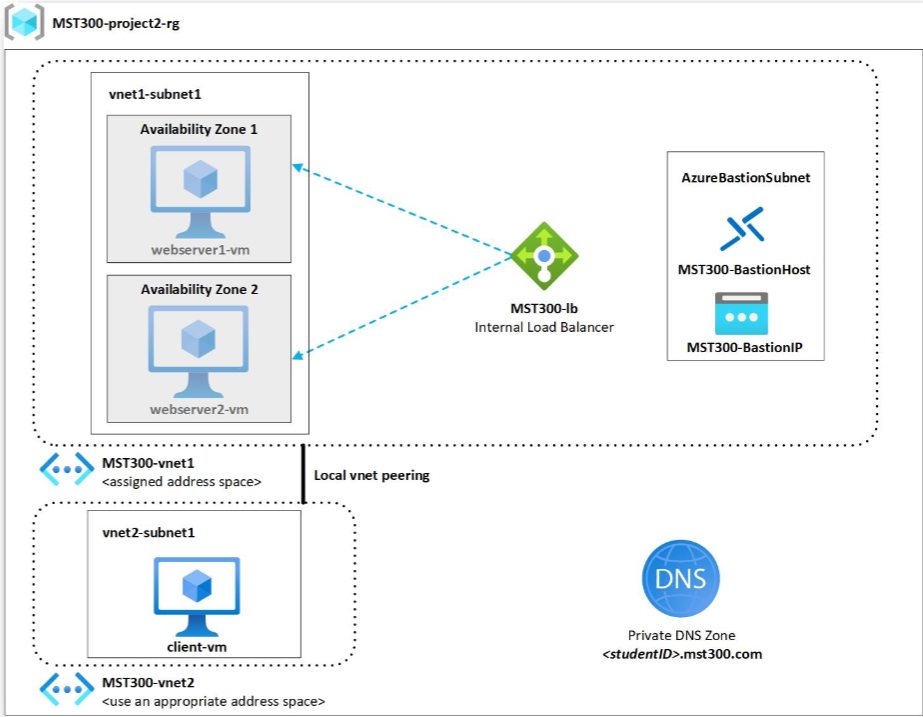

# Architecture Documentation

## Overview

This document provides an in-depth explanation of the Azure infrastructure architecture implemented for the load balancing project.

## Architecture Diagram



## Design Principles

### 1. High Availability
- **Availability Zones**: Web servers deployed across Zone 1 and Zone 2
- **Load Balancing**: Traffic distributed to eliminate single point of failure
- **Health Monitoring**: Automated health probes detect and route around failures

### 2. Security
- **No Public IPs**: All VMs use private IP addresses only
- **Azure Bastion**: Secure RDP access without exposing port 3389
- **Network Isolation**: Separate VNets for different tiers
- **Private DNS**: Internal name resolution prevents DNS leakage

### 3. Scalability
- **Standard Load Balancer**: Supports up to 1000 backend instances
- **Dynamic IP Allocation**: Flexible resource scaling
- **VNet Peering**: Low-latency cross-network communication

---

## Network Architecture

### Address Space Allocation
```
┌─────────────────────────────────────────┐
│  MST300-vnet1 (10.73.0.0/16)           │
│  ┌───────────────────────────────────┐ │
│  │ vnet1-subnet1 (10.73.0.0/24)      │ │
│  │ - webserver1-vm: 10.73.0.4        │ │
│  │ - webserver2-vm: 10.73.0.5        │ │
│  │ - Load Balancer Frontend: 10.73.0.6│ │
│  └───────────────────────────────────┘ │
│  ┌───────────────────────────────────┐ │
│  │ AzureBastionSubnet (10.73.1.0/24) │ │
│  │ - Bastion Host                    │ │
│  └───────────────────────────────────┘ │
└─────────────────────────────────────────┘
                    │
            VNet Peering (bidirectional)
                    │
┌─────────────────────────────────────────┐
│  MST300-vnet2 (10.74.0.0/16)           │
│  ┌───────────────────────────────────┐ │
│  │ vnet2-subnet1 (10.74.0.0/24)      │ │
│  │ - client-vm: 10.74.0.4            │ │
│  └───────────────────────────────────┘ │
└─────────────────────────────────────────┘
```

### Subnet Design Rationale

**vnet1-subnet1 (/24)**: 
- Provides 254 usable IP addresses
- Sufficient for current 2 web servers + future expansion
- Reserved IPs: .0 (network), .1 (gateway), .2-.3 (Azure reserved), .255 (broadcast)

**AzureBastionSubnet (/24)**:
- Minimum /26 required by Azure (64 IPs)
- Using /24 allows for Azure service expansion
- Must be named exactly "AzureBastionSubnet"

**vnet2-subnet1 (/24)**:
- Isolated client network
- Room for additional client VMs or services

---

## Component Architecture

### Load Balancer Deep Dive
```
┌─────────────────────────────────────────────┐
│          MST300-lb (Internal)              │
│                                             │
│  Frontend IP: 10.73.0.6 (Dynamic)          │
│         ↓                                   │
│  ┌───────────────────────────────────┐    │
│  │    Load Balancing Rule            │    │
│  │    Protocol: TCP                   │    │
│  │    Port: 80 → Backend Port: 80    │    │
│  │    Distribution: 5-tuple hash      │    │
│  │    Session persistence: None       │    │
│  └───────────────────────────────────┘    │
│         ↓                                   │
│  ┌───────────────────────────────────┐    │
│  │    Health Probe                    │    │
│  │    Protocol: HTTP                  │    │
│  │    Port: 80                        │    │
│  │    Path: /                         │    │
│  │    Interval: 15s                   │    │
│  │    Unhealthy threshold: 3          │    │
│  └───────────────────────────────────┘    │
│         ↓                                   │
│  ┌───────────────────────────────────┐    │
│  │    Backend Pool                    │    │
│  │    - webserver1-vm (Zone 1)       │    │
│  │    - webserver2-vm (Zone 2)       │    │
│  └───────────────────────────────────┘    │
└─────────────────────────────────────────────┘
```

#### Load Balancing Algorithm
- **5-tuple hash** distribution: Source IP, Source Port, Destination IP, Destination Port, Protocol
- Each unique combination creates a "session" that's consistently routed to same backend
- Refreshing browser (new port) creates new session → different backend

#### Health Probe Behavior
- **Healthy**: HTTP 200 response received within timeout
- **Degraded**: 1-2 consecutive failures
- **Unhealthy**: 3 consecutive failures → removed from rotation

---

### Azure Bastion Architecture
```
    Internet
       │
       ↓
┌──────────────────────┐
│  Azure Bastion       │
│  (PaaS Service)      │
│  Public IP: x.x.x.x  │
└──────────────────────┘
       │
       ↓ (SSL/TLS encrypted)
┌──────────────────────┐
│ AzureBastionSubnet   │
│ (10.73.1.0/24)       │
└──────────────────────┘
       │
       ↓ (Private IPs only)
┌──────────────────────┐
│ Target VMs           │
│ - webserver1-vm      │
│ - webserver2-vm      │
│ - client-vm (peered) │
└──────────────────────┘
```

**Benefits**:
- No public IPs needed on VMs
- No management of NSG rules for RDP/SSH
- Integrated with Azure AD
- Session logging and audit trail
- Protection against port scanning

---

### Private DNS Architecture
```
┌────────────────────────────────────────────┐
│  Private DNS Zone                          │
│  amirzaei7.mst300.com                      │
│                                            │
│  ┌──────────────────────────────────────┐ │
│  │  A Record                            │ │
│  │  www → 10.73.0.6 (Load Balancer)    │ │
│  └──────────────────────────────────────┘ │
│                                            │
│  Virtual Network Links:                   │
│  ├─ MST300-vnet1 (Registration: No)      │
│  └─ MST300-vnet2 (Registration: No)      │
└────────────────────────────────────────────┘
           ↓
    DNS Query Flow:
           ↓
client-vm: nslookup www.amirzaei7.mst300.com
           ↓
Azure DNS Resolver (168.63.129.16)
           ↓
Private DNS Zone lookup
           ↓
Returns: 10.73.0.6 (Load Balancer IP)
```

---

## Traffic Flow

### Scenario 1: Client Accessing Website
```
1. Client VM Browser Request
   client-vm (10.74.0.4)
   ↓
   http://www.amirzaei7.mst300.com

2. DNS Resolution
   ↓ (Query to 168.63.129.16)
   Private DNS Zone
   ↓ (Returns A record)
   10.73.0.6 (Load Balancer Frontend)

3. VNet Peering
   ↓ (vnet2 → vnet1 peering)
   Packet routed to vnet1

4. Load Balancer Processing
   ↓ (5-tuple hash algorithm)
   Backend selection based on:
   - Source: 10.74.0.4:xxxxx (random port)
   - Dest: 10.73.0.6:80

5. Backend Server Response
   webserver1-vm (10.73.0.4) OR
   webserver2-vm (10.73.0.5)
   ↓
   HTTP 200 + HTML content

6. Return Path
   ↓ (Back through Load Balancer)
   ↓ (VNet Peering)
   Client VM receives response
```

### Scenario 2: Health Probe
```
Every 15 seconds:

Load Balancer
   ↓
   HTTP GET / → webserver1-vm:80
   ↓
   Response: HTTP 200 OK ✓
   
   ↓
   HTTP GET / → webserver2-vm:80
   ↓
   Response: HTTP 200 OK ✓

Both healthy → Both remain in pool
```

---

## High Availability Design

### Availability Zones


```
Region: East US
├─ Availability Zone 1
│  └─ webserver1-vm
│     ├─ Compute: Physical isolation
│     ├─ Storage: Zone-redundant
│     └─ Network: Zone-specific
│
├─ Availability Zone 2
│  └─ webserver2-vm
│     ├─ Compute: Physical isolation
│     ├─ Storage: Zone-redundant
│     └─ Network: Zone-specific
│
└─ Zone-Redundant Services
   ├─ Load Balancer (Standard SKU)
   └─ Azure Bastion
```

**Failure Scenarios**:
1. **Zone 1 outage**: Traffic automatically routes to Zone 2
2. **webserver1 failure**: Health probe detects, removes from pool
3. **Network issue in vnet1**: Load balancer continues operation

---

## Security Architecture

### Network Security Groups (NSGs)

**webserver1-vm & webserver2-vm**:
```
Inbound Rules:
├─ Priority 100: Allow HTTP (80) from vnet1-subnet1
├─ Priority 200: Allow Bastion (3389) from AzureBastionSubnet
└─ Priority 65000: DenyAllInbound (default)

Outbound Rules:
├─ Priority 100: Allow to Internet (Windows Updates)
└─ Priority 65000: AllowVnetOutbound (default)
```

**client-vm**:
```
Inbound Rules:
├─ Priority 100: Allow Bastion (3389) from AzureBastionSubnet (via peering)
└─ Priority 65000: DenyAllInbound (default)

Outbound Rules:
├─ Priority 100: Allow to vnet1 (via peering)
└─ Priority 65000: AllowVnetOutbound (default)
```

---

## Design Decisions & Trade-offs

### 1. Internal vs. External Load Balancer
**Decision**: Internal Load Balancer
**Rationale**: 
- Private website accessible only within Azure network
- No public exposure = reduced attack surface
- Simulates real-world internal corporate applications

**Trade-off**: Cannot access from internet (by design)

### 2. Standard vs. Basic Load Balancer
**Decision**: Standard SKU
**Rationale**:
- Availability Zone support
- Enhanced metrics and diagnostics
- Better security features

**Trade-off**: Slightly higher cost (~$0.025/hour)

### 3. Dynamic vs. Static Frontend IP
**Decision**: Dynamic IP allocation
**Rationale**:
- Flexibility for infrastructure changes
- Private DNS abstracts the IP address
- Cost savings (static IPs have charges)

**Trade-off**: IP may change if resources are recreated

### 4. Separate VNets for Client
**Decision**: MST300-vnet2 for client-vm
**Rationale**:
- Demonstrates VNet peering functionality
- Realistic network segmentation
- Better security boundaries

**Trade-off**: Additional complexity vs. single VNet

---

## Performance Characteristics

### Expected Latency
- **Client → Load Balancer**: < 5ms (in-region, peered VNets)
- **Load Balancer → Backend**: < 2ms (same VNet)
- **Total Round Trip**: < 10ms

### Throughput
- **Standard Load Balancer**: Up to 1 Gbps per flow
- **VNet Peering**: Up to 10 Gbps (dependent on VM size)
- **VM Network**: Limited by Standard_B1s NICs (~500 Mbps)

### Scalability Limits
- **Backend Pool**: Up to 1000 instances
- **Concurrent Connections**: Unlimited (Standard SKU)
- **Health Probes**: Every 15s with minimal overhead

---

## Monitoring & Observability

### Key Metrics to Monitor

**Load Balancer**:
- Data Path Availability (health probe status)
- Byte Count / Packet Count
- SYN Count (new connections)
- Backend Pool Health

**Virtual Machines**:
- CPU Utilization
- Network In/Out
- Disk IOPS
- IIS Request Rate

**VNet Peering**:
- Bytes Transferred
- Packets Dropped

---

## Cost Analysis

### Monthly Cost Estimate (Azure for Students)

| Resource | Quantity | Unit Cost | Monthly Cost |
|----------|----------|-----------|--------------|
| Standard_B1s VMs | 3 | $0.0104/hr | ~$22.46 |
| Standard Load Balancer | 1 | $0.025/hr | ~$18.00 |
| Azure Bastion | 1 | $0.19/hr | ~$136.80 |
| VNet Peering | Data transfer | $0.01/GB | ~$1.00 |
| Private DNS | 1 zone | $0.50/month | $0.50 |
| **Total** | | | **~$178.76** |

**Cost Optimization**:
- Delete Bastion when not needed (biggest cost)
- Use B-series burstable VMs (already optimized)
- Deallocate VMs when not testing

---

## Future Enhancements

### Potential Improvements
1. **Application Gateway**: Layer 7 load balancing with WAF
2. **Azure Monitor**: Comprehensive logging and alerting
3. **Auto-scaling**: VM Scale Sets based on load
4. **SSL/TLS**: HTTPS with certificates
5. **Content Delivery**: Azure CDN integration
6. **Backup**: VM snapshots and Azure Backup
7. **Disaster Recovery**: Secondary region replication

---

## Conclusion

This architecture demonstrates a production-ready internal web application infrastructure with:
- ✅ High availability across availability zones
- ✅ Automated health monitoring and traffic distribution
- ✅ Secure access without public IP exposure
- ✅ Scalable design supporting future growth
- ✅ Private DNS for internal name resolution
- ✅ Network segmentation via VNet peering

The design follows Azure best practices for security, reliability, and performance.

---

**Next**: See [SETUP-GUIDE.md](./SETUP-GUIDE.md) for implementation steps.
